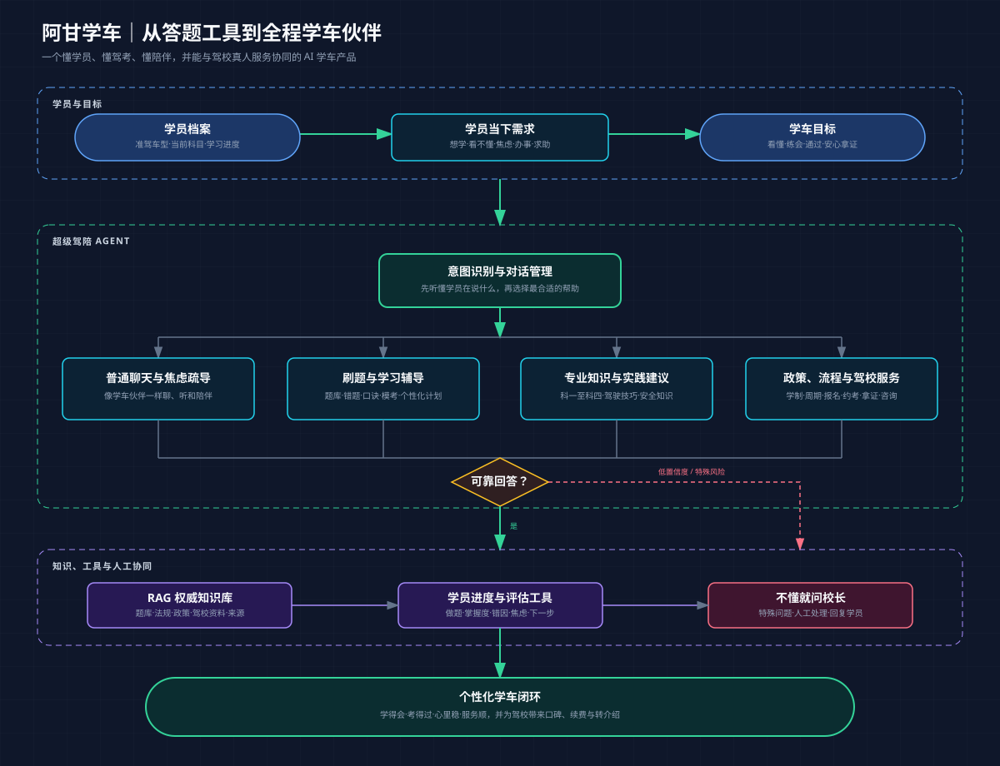

# 阿甘学车｜AI 学车伙伴

## 我们最终要做成什么

阿甘学车的最终目标，不是再做一个只会出题和对答案的刷题软件，而是成为学员从报名到拿证全过程中的 **AI 学车伙伴**。

核心 AI 角色“**超级驾陪**”需要同时懂得：

- **懂学员**：知道他学什么车型、到了哪个科目、卡在哪里，也能听懂焦虑和气馁。
- **懂驾考**：能准确回答理论题、解释驾驶技巧、制定学习计划，并用题库、错题、口诀和模考帮助学员通过考试。
- **懂服务**：能解释政策、学制、约考、拿证周期和驾校流程，不确定或高风险问题交给真人校长。
- **会越用越懂你**：结合学员档案、学习进度、错因和反馈，持续调整建议，而不是每次从头开始。

对学员，它是一个有陪伴价值且回答准确的学车 AI；对驾校，它是一套能够进入一线服务、连接学员档案和真人教练的智能服务能力。最终用更好的学习体验、更稳定的考试通过和更顺畅的服务，带来口碑、续费与转介绍。

## 产品蓝图

## 线上测试入口

- [学员端｜体验阿甘学车](https://sjg752jmtbn2sckvrv72q.apigateway-cn-beijing.volceapi.com/enter)
- [校长端｜打开校长工作台](https://sjg752jmtbn2sckvrv72q.apigateway-cn-beijing.volceapi.com/staff/enter)

> 当前为邀请制测试版，请向项目管理员获取对应身份的邀请码。本仓库已开放源代码，用于展示产品方案与当前实现；线上环境密钥、正式题库和学员数据不会进入仓库。

## 当前版本：V2.1 Beta

### 本次更新

- 新增“卡片刷题”入口，可在对话输入框上方直接调出常见场景卡，不必离开当前对话。
- 建立首批 12 个高频媒体学习场景，覆盖路口让行、环岛、人行横道、高速、恶劣天气和应急处置等主题。
- 场景卡支持核心说明、一句学车口诀和“让超级驾陪讲解”的连续对话入口。
- 完成“无信号路口让行”首个可播放动态演示，支持播放、暂停和默认静音。
- 优化手机端卡片布局、触控尺寸与响应式显示，375px 宽度下无横向溢出。
- 后续媒体内容将根据真实咨询量、错题率和“还不懂”反馈排序开发，不盲目铺量。

### 已经完成

- 学员邀请制进入、对话式首页与移动端交互。
- “超级驾陪”普通聊天、焦虑疏导、学车意图识别和口语化回复。
- C1 科目一刷题、错题、收藏、模拟考试、答案解释与学车口诀框架。
- 文字与图片提问、OCR 校正确认流程。
- RAG 知识库基础链路，当前连接 1,388 条 C1 题库预览数据。
- “不懂就问校长”工单、校长工作台、知识条目管理与评测页面。
- 敏感信息、提示词注入与高风险问题的基础防护。
- 图片知识卡、场景卡刷题与首个动态教学演示框架。
- 学员端与校长端已部署到线上测试环境，数据持久化已接入 TOS。

### 下一步重点

- 用正式授权题库替换研究预览数据，补全法规、政策、学制、约考和拿证流程等权威知识。
- 把学员档案、学习进度、错因和学习计划真正打通，形成长期记忆与个性化辅导。
- 完成 C2 理论共用与其他准驾车型、科目二至科目四的知识和服务框架。
- 建立回答准确性、陪伴体验、意图识别、RAG 命中和安全攻防的评测集。
- 开展压力测试、并发测试、故障注入、日志监控、成本监控与正式题库切换验收。

## 仓库与运行说明

- 前端：Next.js + TypeScript。
- 后端：FastAPI + SQLite（测试版）。
- 模型：通过后端调用，API Key 不会下发到浏览器。
- 部署：火山引擎 veFaaS + APIG，持久化备份使用 TOS。
- 安全：不提交 `.env` 或任何真实密钥；邀请码不在公开体验页面展示。
