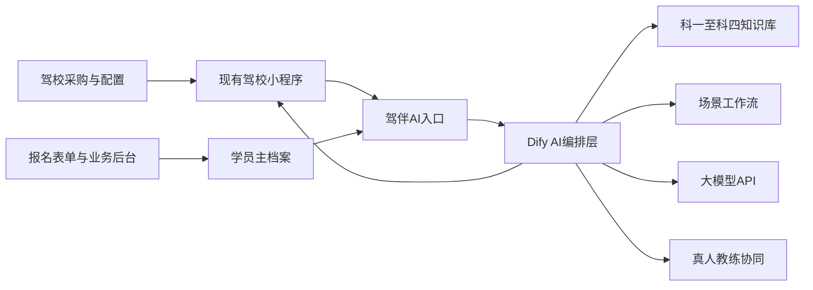
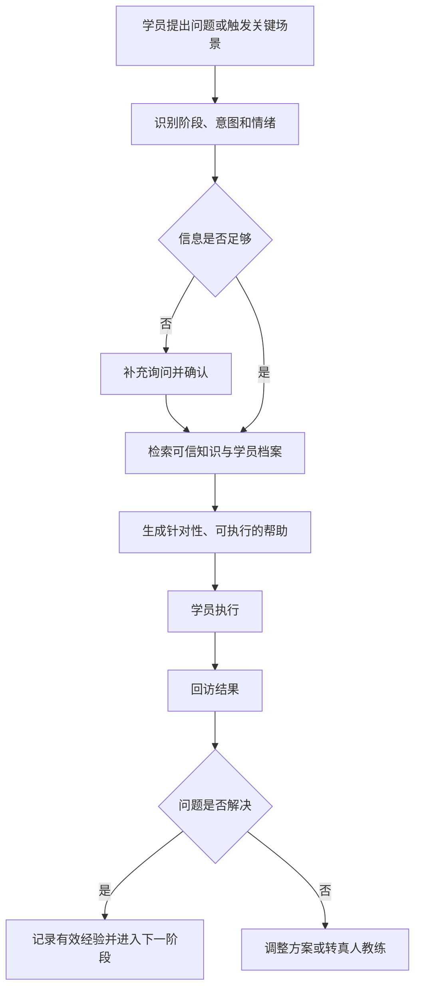

# 驾校项目构思与逻辑走向梳理

> **一句话结论：** 这个项目已经从“回答报名咨询的驾校智能客服”，逐步收敛为“由驾校采购、嵌入现有小程序、主要服务已报名学员的全流程 AI 学车陪伴助手”；它的核心不是多回答问题，而是在正确时间给学员可信、针对性强、可以执行，并且能验证效果的帮助。

## 一、当前确认的产品定义

### 项目名称

**驾伴AI——驾校学员全流程智能陪伴助手**

### 产品定位

驾伴AI是一套 B2B2C 产品：

- 采购与配置方：驾校
- 主要使用者：已经报名、正在学车或准备考试的学员
- 使用入口：驾校已有小程序
- AI能力平台：现阶段确定使用 Dify
- 主要服务阶段：报名完成后，贯穿科目一至科目四、训练、考试、补考及结业过程

它不是以外部获客为核心的招生机器人，也不是驾校员工使用的内部管理系统。招生咨询和转化可以保留为辅助功能，但不是产品主线。

### 核心价值

> 让学员在每个阶段都知道下一步做什么，遇到问题能够及时得到有效帮助，在临近考试、训练受挫或考试失败等关键时刻获得学习与情绪支持。

“有效帮助”应同时满足：

1. 符合学员当前阶段和真实情况；
2. 信息来源可信，不确定时不猜测；
3. 建议具体、可立即执行；
4. 出现在合适的时间；
5. 回访执行结果，判断问题是否真正解决。

## 二、构思演变与关键转折

| 阶段 | 当时的构思 | 发现的问题 | 修正后的结论 |
|---|---|---|---|
| 1. 驾校问答助手 | 以宁波地区驾校教练角色回答报名、场地、费用、政策和培训问题；通过搜索补充实时信息 | 范围偏“咨询客服”，强行推荐固定驾校容易损害可信度；缺少报名后的长期价值 | 搜索和知识问答保留，但不再作为全部产品 |
| 2. 招生与转化助手 | 聚焦招生咨询、线索收集和报名转化 | 用户明确指出产品不直接承担获客入口，招生不是核心 | 招生与转化退为辅助功能 |
| 3. 驾校内部管理助手 | 理解为员工使用的学员管理、排课、约考和异常预警平台 | “企业购买”被错误理解成“企业内部人员使用” | 采购方是驾校，核心使用者仍然是学员 |
| 4. 报名后 AI 学车教练 | 面向已报名学员，提供流程导航、知识答疑和学习指导 | 只有信息检索仍然不够，无法体现关键时刻的陪伴价值 | 增加专项练习、考前计划、情绪支持和真人协同 |
| 5. B2B2C 智能陪伴产品 | 驾校采购，学员在既有小程序使用；报名表单和业务系统提供档案 | 不能让学员反复说明身份和进度，也不能让 Dify 代替业务数据库 | 小程序后台保存主档案，Dify只接收完成任务所需信息 |
| 6. 有效帮助闭环 | 日常答疑＋关键节点主动服务 | AI回复并不等于问题被解决 | 加入执行、回访、效果判断、调整方案与人工转接闭环 |
| 7. 专业内容体系 | 建设科一至科四知识库和技巧内容 | 通用大模型难以稳定覆盖本地规则、车型差异和教练经验 | 形成持续审核、更新和积累的专业驾考内容资产 |

## 三、最终形成的产品逻辑

### 1. 产品关系

各部分职责已经基本明确：

- 小程序：登录、聊天入口、表单、消息展示与推送；
- 业务后台：学员档案、学习阶段、考试时间、计划和权限；
- Dify：场景识别、知识检索、工作流编排和模型调用；
- 大模型：理解问题、组织答案、生成计划和陪伴内容；
- 知识库：提供经审核的专业信息与技巧内容；
- 真人教练：处理实车训练、安全风险和复杂个体问题。

### 2. 学员信息进入系统的方式

信息不是完全依赖学员每次主动说明，而是通过三条路径形成：

1. 报名时填写表单，自动建立基础档案；
2. 驾校工作人员补充或更新进度、考试、教练等信息；
3. AI从后续对话中提取新的有效信息，经学员确认后写回业务后台。

建议收集的核心信息包括：驾照类型、当前科目、训练阶段、所属教练、可训练时间、考试时间、薄弱项目和必要的学习需求。

### 3. 服务机制

产品采用“日常被动答疑＋关键节点主动陪伴”的混合模式。

#### 日常模式

平时主要由学员主动提问，AI结合档案、当前科目和知识库回答，避免频繁打扰。

#### 关键节点模式

当系统识别到“马上考试”“最近没练”“总是出错”“很紧张”“刚刚挂科”等信息时：

> 识别场景 → 判断缺失信息 → 继续追问 → 学员确认 → 更新档案 → 生成计划或建议 → 小程序定时推送 → 回访执行效果

例如，学员说“下周要考科目一”，AI应继续询问考试日期、每天可用时间、当前模拟成绩和薄弱知识点，再制定计划，而不是只回复一份通用复习攻略。

### 4. 有效帮助闭环

这条闭环是产品从“聊天机器人”升级为“学车陪伴助手”的关键。

## 四、核心功能结构

### 学车流程导航

告诉学员当前处于什么阶段、下一步做什么、需要准备什么材料，以及不同科目如何衔接。

### 日常知识答疑

覆盖驾考政策、考试规则、理论知识、训练疑问和常见错误。涉及实时政策时，应以官方或驾校审核信息为准。

### 科目专项学习

- 科目一：法规、标志标线、高频考点、易错题、错题解析；
- 科目二：按训练项目和具体错误拆分技巧卡；
- 科目三：按道路项目、动作流程和安全判断拆分问题；
- 科目四：安全文明驾驶、复杂天气、事故处理和情景判断。

### 考前准备

结合考试日期、剩余时间、薄弱点和可训练次数，生成复习计划、模拟题、考前清单和当天提醒。

### 情绪陪伴

识别紧张、挫败、害怕、挂科后失去信心等状态，先回应情绪，再给少量明确任务，必要时联系真人教练。

### 考试结果与复盘

考试后询问结果。通过则更新阶段；未通过则区分技术、流程和情绪原因，形成下一轮计划。

### 真人教练协同

当问题涉及实车操作、安全风险、个体动作纠正、身体状况或无法确认的政策时，AI整理问题摘要并转交或提醒联系真人教练。

## 五、专业知识资产的建设方向

### 知识库分层

> 公共基础知识库＋科目专项知识库＋驾校专属知识库

长期可形成六类内容资产：

1. 学车流程与政策知识库；
2. 科目一理论与题库；
3. 科目二项目技巧库；
4. 科目三道路训练技巧库；
5. 科目四安全文明理论与题库；
6. 考前准备、失败复盘与情绪陪伴知识库。

### 科二、科三技巧卡结构

每个具体问题建议沉淀为标准解决卡：

1. 学员看到的表现；
2. 可能原因；
3. AI需要继续追问的问题；
4. 下一次训练需要观察的重点；
5. 可以尝试的练习方式；
6. 常见错误调整方向；
7. 必须由真人教练现场确认的内容。

### 更新机制

> 收集高频问题与失败案例 → AI归类并生成草稿 → 专业教练审核 → 标注科目、车型和适用场景 → 发布 → 观察反馈 → 持续修正

长期壁垒不只是模型，而是经过持续审核的专业内容、学员问题数据和有效服务机制。

## 六、产品价值链

### 对学员

- 少走弯路，清楚下一步做什么；
- 随时获得符合当前阶段的帮助；
- 在考前和受挫时得到支持；
- 不必重复说明自己的基本情况；
- 复杂问题能够顺利连接真人教练。

### 对驾校

- 降低真人教练重复答疑压力；
- 提升学员满意度和课程完成率；
- 降低流失和退费风险；
- 提升学员信任和口碑推荐；
- 为陪练、增驾等后续服务创造转化机会。

这里不宜把“复购”直接作为第一价值，因为大部分学员拿证后不会立刻再次购买同类课程。更准确的商业路径是：

> 有效帮助 → 学员体验提升 → 满意度与信任提升 → 完成率、口碑推荐和后续服务转化提升

## 七、核心指标

### 已确认的两个核心指标

1. **有效帮助率**：学员是否确认问题已解决，或已经明确知道下一步该怎么做；
2. **学员满意度**：学员对信息、指导、陪伴和整体体验的评价。

### 可作为辅助指标

- 关键任务完成率；
- 重复咨询减少率；
- 人工转接准确率；
- 学员课程完成率；
- 口碑推荐率；
- 陪练、增驾等后续服务转化率。

考试通过率不宜作为唯一指标，因为它还受到学员基础、训练时长、真人教练水平和考试环境等因素影响。

## 八、已明确否定或修正的表达

为了避免后续文档重新走偏，以下方向已经被沟通否定或修正：

- 不是以招生获客为核心的客服机器人；
- 不是主要给驾校员工使用的内部管理系统；
- 不是只提高“信息检索效率”的知识问答工具；
- 不建议用“千人千面”描述核心亮点，容易被理解为推荐算法；
- Dify只是AI编排层，不是完整产品，也不应承担主学员数据库；
- AI不能替代真人教练进行实车操作和安全指导；
- 不把“复购”作为最直接的商业结果；
- 不强制把固定驾校推荐写进所有回答，信息可信应优先于营销话术。

建议统一使用以下三个亮点表述：

1. 基于档案与阶段的个性化指导；
2. 关键节点触发式学习与情绪陪伴；
3. 效果反馈与真人教练协同闭环。

## 九、当前可落地的 MVP

### MVP范围

- 接入现有驾校小程序；
- 通过报名表单建立基础学员档案；
- 以Dify承载场景判断、知识检索和工作流；
- 先覆盖流程问答、科一/科四理论、科二/科三高频问题；
- 支持“即将考试、紧张、挂科”等关键场景；
- 支持考试日期追问、简单计划生成和小程序提醒；
- 支持回答后追问“是否解决”；
- 对安全或复杂问题转真人教练。

### 后续迭代

- 扩充并独立维护科一至科四知识库；
- 建立个人错题、薄弱项目和学习效果记录；
- 自动读取更完整的训练和考试数据；
- 为不同驾校配置品牌、流程、场地和专属内容；
- 建立教练审核、纠错和知识更新后台；
- 用真实反馈优化场景识别、推送时机和内容效果。

## 十、仍待确认的问题

以下内容在沟通中尚未最终定稿，后续写PRD时需要继续确认：

1. 现有小程序已经具备哪些学员账号、报名、科目、考试和推送能力；
2. 学员档案的字段范围、数据来源、更新权限和隐私授权方式；
3. 首版具体覆盖哪些科目、地区和驾照类型；
4. 底层大模型的选择、成本、响应速度和安全策略；
5. Dify采用云端还是自托管，如何与小程序后台鉴权；
6. 关键节点的具体触发条件、推送频率和关闭方式；
7. 真人教练转接入口、响应责任和超时处理；
8. 知识库内容由谁审核、多久更新、错误内容如何下线；
9. “有效帮助率”的埋点、问卷和计算口径；
10. 驾校侧是否需要查看学员问题、情绪状态和服务效果，以及权限边界；
11. 首批试点驾校、目标学员规模和商业收费方式；
12. 招生咨询辅助功能是否进入MVP，还是完全放到后续版本。

## 十一、文档协作方式上的共识

沟通中还形成了几条重要的协作要求：

- 先讨论、确认，再正式写文档，不要直接替用户做决定；
- 每个主要部分先放一段简洁结论，再正常展开，而不是把全文过度浓缩；
- 解决方案可以加入流程图、思维导图等可视化结构；
- 作业和日常课堂笔记是两类文档，不要混为一谈；
- 项目文档不使用“Day几”作为标题，直接使用项目名称；
- 做平台选型时基于当前需求重新比较，不被既有上下文或熟悉工具锚定。

## 十二、一句话理解整个逻辑

> 驾校提供入口、档案和专业内容，Dify负责理解学员当前所处的阶段与场景，AI在平时回答问题、在关键节点主动介入，并通过执行反馈和真人教练协同，确保给出的不是“回复”，而是真正有效的帮助。
